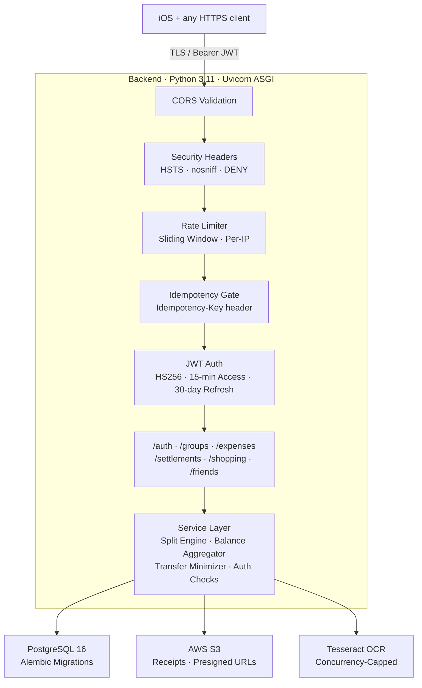
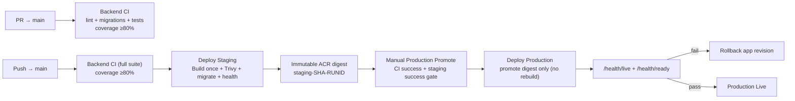

# ClearSplit

Expense-splitting API built with **FastAPI**, **PostgreSQL 16**, and **SQLAlchemy 2.0 async**. Handles group expenses, shopping sessions with receipt OCR, and minimum-transfer settlement computation using deterministic integer-cent arithmetic. Deployed to **Azure Container Apps** with fully automated CI/CD via GitHub Actions.

## Backend & Ops Highlights

- **FastAPI + async SQLAlchemy 2.0** on Uvicorn ASGI — fully non-blocking I/O with asyncpg
- **PostgreSQL 16** — ACID-compliant financial storage; check constraints, cascade deletes, optimistic locking
- **Alembic migrations** — 14 revisions; CI validates forward-only apply + precheck on every push
- **JWT auth (HS256)** — 15-min access / 30-day refresh tokens, JTI rotation chain, timing-safe login (dummy hash on unknown users)
- **Idempotency layer** — `Idempotency-Key` header on POST endpoints; same key + payload → cached response, different payload → 409
- **Rate limiting** — in-memory sliding window per IP (signup 5/5 min, login 10/60 s, refresh 20/60 s)
- **Security hardened** — CORS validated at startup, HSTS, `nosniff`, `DENY`, validation sanitizer strips passwords from 422 bodies, DB TLS enforced in non-local envs
- **Receipt OCR pipeline** — Tesseract in-process with concurrency cap; images in S3 with presigned URLs (15-min TTL)
- **Deterministic financial math** — all amounts as `bigint` cents; remainder distribution on splits, zero floating-point
- **Staging + Production on Azure Container Apps** — OIDC federation, health-gated rollout, rollback on failure
- **143+ pytest tests** — unit, integration, e2e; 80 % coverage gate on both PR and main
- **7 workflow files under `.github/workflows`** — backend CI, staging deploy, production promote, reusable deploy core, security scan, iOS PR checks, iOS main checks

## Quickstart (Docker)

```bash
git clone <repo-url> && cd ClearSplit
cp .env.example .env
echo "JWT_SECRET=$(openssl rand -hex 32)" >> .env
docker compose up --build
# API  → http://localhost:8000
# Docs → http://localhost:8000/docs
```

`docker-compose.yml` runs PostgreSQL 16 + the API with live reload (volume-mounted `./backend`).

## Local Dev (No Docker)

```bash
cd backend
python3.11 -m venv venv && source venv/bin/activate
pip install -r requirements-dev.txt
# Requires PostgreSQL 16 running + DATABASE_URL in .env
alembic upgrade head
make run   # uvicorn --reload on :8000
```

Key targets: `make test` · `make migrate` · `make ci-pr` (lint + tests, 80 %) · `make ci-main` (full suite, 80 %)

## Architecture



## CI/CD & Deployment



Azure auth uses **OIDC federation** — no static credentials stored anywhere. Secrets injected as ACA secret references.

Additional workflows: `security-scan.yml` (TruffleHog + pip-audit + Bandit, PR/push/weekly).

## API at a Glance

40+ endpoints across 6 domain routers. OpenAPI UI at `/docs` when `ENV=local`.

| Method | Endpoint | Notes |
| ------ | -------- | ----- |
| POST | `/auth/signup` | Rate-limited: 5/5 min per IP |
| POST | `/auth/login` | Timing-safe; rate: 10/60 s |
| POST | `/auth/refresh` | JTI rotation; revokes old token |
| POST | `/groups/{id}/expenses` | Idempotent via `Idempotency-Key` |
| GET | `/groups/{id}/balances` | Live balances + suggested transfers |
| POST | `/groups/{id}/settlements/compute` | Immutable settlement batch |
| POST | `/shopping-sessions/{id}/receipt` | Upload receipt (10 MB / 25 MP limit) |
| POST | `/receipts/{id}/extract-items` | OCR extraction (idempotent) |
| GET | `/health/live` | Liveness probe (always 200) |
| GET | `/health/ready` | Readiness probe (DB + S3) |

### Example Requests

```bash
# 1) Login
curl -X POST https://api.example.com/auth/login \
  -H "Content-Type: application/json" \
  -d '{"identifier": "alice@example.com", "password": "s3cret!"}'

# 2) Create expense with Idempotency-Key
curl -X POST https://api.example.com/groups/GRP_ID/expenses \
  -H "Authorization: Bearer ACCESS_TOKEN" \
  -H "Idempotency-Key: 550e8400-e29b-41d4-a716-446655440000" \
  -H "Content-Type: application/json" \
  -d '{"title": "Dinner", "amount_cents": 4500, "expense_date": "2026-02-19"}'

# 3) Get group balances
curl https://api.example.com/groups/GRP_ID/balances \
  -H "Authorization: Bearer ACCESS_TOKEN"
```

## Documentation

| Document | Path |
| -------- | ---- |
| Documentation Index | [docs/INDEX.md](docs/INDEX.md) |
| Architecture | [docs/architecture.md](docs/architecture.md) |
| Backend Reference | [docs/backend-reference.md](docs/backend-reference.md) |
| Workflows & Operations | [docs/workflows-and-operations.md](docs/workflows-and-operations.md) |
| Security Policy | [SECURITY.md](SECURITY.md) |
| App Showcase | [SHOWCASE.md](SHOWCASE.md) |

Full endpoint tables, ERD, request lifecycle, database schema, and env-var reference live in [docs/](docs/INDEX.md).

## iOS Client

Native SwiftUI app (MVVM, zero external dependencies, Keychain-backed auth). See the full design walkthrough in [SHOWCASE.md](SHOWCASE.md).
