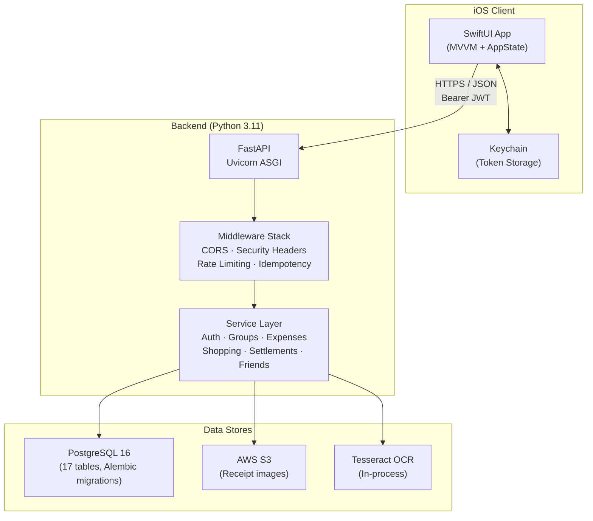
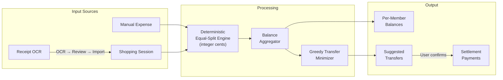
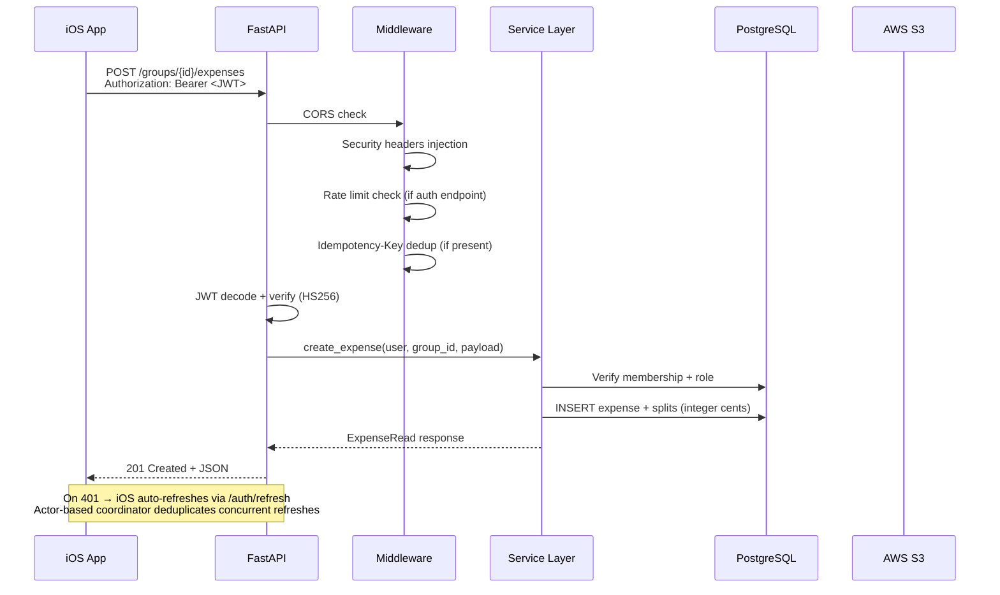
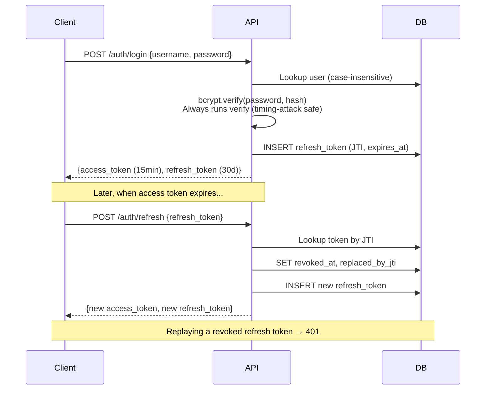
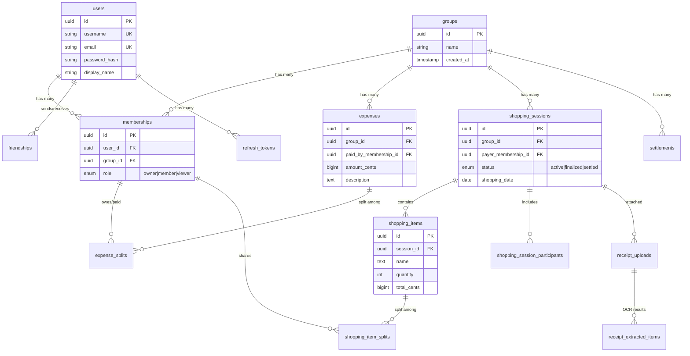
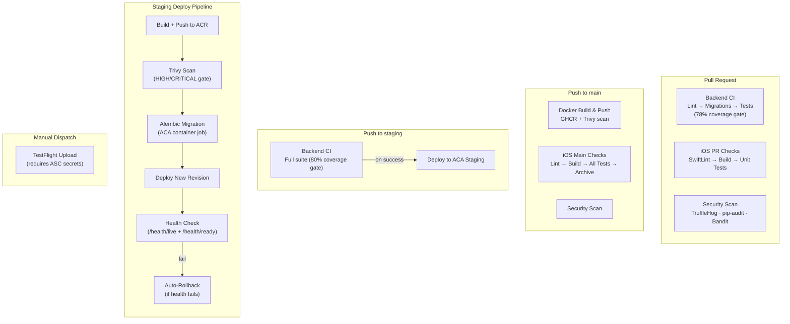

# ClearSplit

ClearSplit is a full-stack expense-splitting platform for groups of people — roommates, travel companions, dinner friends — who share costs and want to settle up fairly. A **Python/FastAPI backend** handles group finances, shopping session tracking, and receipt OCR, while a **native SwiftUI iOS app** gives users a polished mobile experience with offline-safe token management and zero external dependencies. The system computes who-owes-whom using deterministic integer arithmetic (no floating-point rounding surprises) and minimizes the number of transfers needed to settle a group.

## Table of Contents

- [System Architecture](#system-architecture)
- [Data Flow](#data-flow)
- [Request Lifecycle](#request-lifecycle)
- [Backend](#backend)
- [iOS App](#ios-app)
- [CI/CD](#cicd)
- [Deployment & Operations](#deployment--operations)
- [Local Development](#local-development)
- [What This Repo Contains](#what-this-repo-contains)
- [Contributing](#contributing)
- [Security](#security)

---

## System Architecture

The system is a classic client-server split: a stateless API backed by PostgreSQL and S3, consumed by the iOS app over HTTPS/JSON.



**Why each piece exists:**

| Component | Role |
|-----------|------|
| **FastAPI + Uvicorn** | Async Python framework — native `async/await` pairs well with asyncpg for non-blocking DB access |
| **SQLAlchemy 2.0 async** | Type-safe ORM with async session support; Alembic handles schema evolution |
| **PostgreSQL 16** | Relational integrity for financial data — foreign keys, check constraints, and unique indices enforce correctness |
| **S3 (boto3)** | Receipt images stored privately; presigned URLs (15-min TTL) grant temporary download access |
| **Tesseract (pytesseract)** | On-device OCR runs in-process with concurrency cap (default 2) — no external ML service needed |
| **SwiftUI + MVVM** | Declarative UI with zero external dependencies; actor-based `AuthCoordinator` deduplicates concurrent token refreshes |
| **Keychain** | iOS secure enclave for JWT storage — tokens never touch `UserDefaults` or disk |

*Inferred from: `backend/app/main.py`, `backend/app/core/config.py`, `backend/app/db/session.py`, `backend/Dockerfile`, `ios/ClearSplit/Sources/ClearSplit/Networking/APIClient.swift`, `ios/ClearSplit/Sources/ClearSplit/Config/APIConfig.swift`*

---

## Data Flow

How money-related data moves through the system, from expense creation to settlement:



All financial arithmetic uses **integer cents** with deterministic remainder distribution. When splitting $10.00 among 3 people, the payer gets the extra cent: `[334, 333, 333]`. This is enforced in `backend/app/services/shopping.py` and `backend/app/services/expense.py`.

---

## Request Lifecycle

What happens when the iOS app makes an authenticated API call:



*Inferred from: `backend/app/main.py:83-104` (middleware), `backend/app/api/auth.py` (JWT), `backend/app/api/expenses.py` (route), `ios/ClearSplit/Sources/ClearSplit/Networking/APIClient.swift:144-190` (retry logic)*

---

## Backend

### Tech Stack

| Layer | Technology | Why |
|-------|-----------|-----|
| Framework | FastAPI 0.122 + Uvicorn | Async-native, auto-generated OpenAPI docs, Pydantic validation |
| ORM | SQLAlchemy 2.0 (async mode) | Type-safe queries, relationship loading, migration support |
| Database | PostgreSQL 16 + asyncpg | ACID compliance for financial data, async driver |
| Migrations | Alembic (14 revisions) | Schema versioning with upgrade/downgrade support |
| Auth | PyJWT (HS256) + bcrypt | Stateless access tokens, secure password hashing |
| Storage | boto3 (S3) | Private bucket with presigned URLs for receipt images |
| OCR | pytesseract + Pillow | In-process text extraction with image validation |
| Config | pydantic-settings + SecretStr | Type-safe env loading, secrets never leak to logs |

### API Surface

40+ endpoints across 7 domains. OpenAPI docs available at `/docs` in local/test environments.

| Domain | Prefix | Key Endpoints | Auth |
|--------|--------|--------------|------|
| **Health** | `/health` | `GET /live`, `GET /ready` | No |
| **Auth** | `/auth` | `POST /signup`, `POST /login`, `POST /refresh`, `GET /me` | No (except `/me`) |
| **Groups** | `/groups` | CRUD + member management (preview → add), role-based access | Yes |
| **Expenses** | `/groups/{id}/expenses` | Create (idempotent), list by group, get by ID | Yes |
| **Settlements** | `/groups/{id}` | Balances, compute settlement batch, payment CRUD + confirmation | Yes |
| **Shopping** | `/groups/{id}/shopping-sessions` | Session lifecycle, items CRUD, participant management, receipt upload/OCR | Yes |
| **Friends** | `/friends` | Send/accept/decline requests, list friends, remove | Yes |

### Auth Model



- Access tokens: JWT (HS256), 15-minute expiry, explicit `token_type: "access"` claim
- Refresh tokens: Persisted in `refresh_tokens` table with unique JTI, 30-day expiry
- Rotation: Old token revoked on refresh; `replaced_by_jti` creates an audit chain
- Passwords: bcrypt via `bcrypt.gensalt()`; unknown users still run a dummy hash comparison

*Inferred from: `backend/app/auth/jwt.py`, `backend/app/api/auth.py`, `backend/app/models/refresh_token.py`*

### Database Schema

17 tables managed by SQLAlchemy ORM + Alembic. Key entities and their relationships:



Key integrity rules enforced by the schema:
- **Check constraints**: `quantity >= 1`, `total_cents > 0`, `share_cents >= 0`
- **Unique constraints**: one split per item per member, one membership per user per group
- **Cascade deletes**: deleting a session removes its items, splits, and receipts
- **Role enum**: `owner`, `member`, `viewer` — authorization checked at service layer

*Inferred from: `backend/app/models/*.py` (17 model files)*

### Middleware & Cross-Cutting Concerns

| Concern | Implementation | File |
|---------|---------------|------|
| CORS | Environment-aware origins; non-local must be HTTPS | `backend/app/main.py:46-89` |
| Security headers | `X-Content-Type-Options`, `X-Frame-Options`, `Referrer-Policy`, HSTS (non-local) | `backend/app/main.py:92-104` |
| Rate limiting | In-process sliding window (signup: 5/5min, login: 10/60s per IP) | `backend/app/core/rate_limit.py` |
| Idempotency | `Idempotency-Key` header; same key + same payload = cached response, different payload = 409 | `backend/app/core/idempotency.py` |
| Validation sanitization | Raw input values stripped from error responses (prevents password leakage) | `backend/app/main.py:107-136` |
| DB TLS | Enforced in non-local environments; invalid SSL configurations rejected at startup | `backend/app/db/connect_args.py` |

---

## iOS App

### Architecture

The app follows **MVVM** with a central `AppState` coordinator that owns the `APIClient` and manages authentication state.

```
Sources/ClearSplit/
├── State/AppState.swift          # Central coordinator (auth state, API client)
├── Config/APIConfig.swift        # Base URL resolution
├── Networking/
│   ├── APIClient.swift           # HTTP client with auto-refresh
│   ├── AuthService.swift         # Login, signup, token refresh
│   ├── GroupsService.swift       # Group CRUD
│   ├── ShoppingService.swift     # Sessions, items, receipts
│   ├── SettlementService.swift   # Balances, payments
│   └── FriendsService.swift      # Friend requests
├── ViewModels/                   # 7 screen-level VMs
├── Views/                        # 44 views + 26 reusable components
├── Models/                       # Codable structs matching API schemas
├── Storage/KeychainService.swift # Secure token persistence
└── DesignSystem/                 # Colors, typography, button styles
```

**Key design decisions:**
- **Zero external dependencies** — pure Foundation + SwiftUI (no Alamofire, no Kingfisher)
- **Actor-based `AuthCoordinator`** — deduplicates concurrent token refresh requests; if 5 requests hit 401 simultaneously, only one refresh call is made
- **Keychain storage** — JWTs stored via Security framework, never in `UserDefaults`
- **Snake-case / camelCase bridging** — `JSONDecoder.keyDecodingStrategy = .convertFromSnakeCase` bridges Python API conventions

### Connecting to the Backend

The iOS app resolves its API base URL in this priority order:

1. **Environment variable** `API_BASE_URL` (Xcode scheme → Run → Environment Variables)
2. **Info.plist key** `API_BASE_URL`
3. **Default**: `http://127.0.0.1:8000` (works on Simulator; physical devices need a LAN IP)

On 401 responses, the `APIClient` automatically attempts a token refresh via `POST /auth/refresh` before retrying the original request. If refresh fails, the user is logged out.

### Key Screens

| Screen | What It Does |
|--------|-------------|
| Login / Sign Up | Username or email auth with form validation |
| Groups List | User's groups with member counts |
| Group Detail | Expenses, shopping sessions, balances, member list |
| Shopping Session | Items with per-person splits, receipt upload |
| Receipt Review | OCR-extracted items with confidence scores for import |
| Balances & Settlement | Who owes whom, suggested transfers, payment confirmation |
| Friends | Send/accept requests, friend list |
| Profile | Current user info, logout |

### Running the iOS App

```bash
# Prerequisites: Xcode 15+, macOS
open ios/ClearSplit/ClearSplit/ClearSplit.xcodeproj

# Make sure the backend is running first:
docker compose up -d

# Run on Simulator — connects to localhost:8000 automatically
# Run on device — set API_BASE_URL in scheme env vars to your Mac's IP
```

*Inferred from: `ios/ClearSplit/Sources/ClearSplit/Config/APIConfig.swift`, `ios/ClearSplit/Sources/ClearSplit/Networking/APIClient.swift`, `ios/ClearSplit/Package.swift`*

---

## CI/CD

### Pipeline Overview



### What Runs When

| Trigger | Backend | iOS | Security | Docker | Deploy |
|---------|---------|-----|----------|--------|--------|
| **PR to main/develop** | Lint + migrations + tests (78%) | SwiftLint + build + unit tests | TruffleHog + pip-audit + Bandit | — | — |
| **Push to main** | — | Full tests + archive | TruffleHog + pip-audit + Bandit | Build + GHCR push + Trivy | — |
| **Push to staging** | Full suite (80%) + Docker archive | — | — | — | ACR → Trivy → migrate → deploy → health check |
| **Weekly (Sunday)** | — | — | Full security scan | — | — |
| **Manual dispatch** | On-demand | TestFlight upload | — | On-demand | On-demand |

### Artifacts Produced

| Workflow | Artifact | Registry | Retention |
|----------|----------|----------|-----------|
| Backend CI (PR) | Coverage XML, JUnit XML, pytest log | GitHub Actions | 14 days |
| Backend CI (staging) | Coverage XML, JUnit XML, Docker image metadata | GitHub Actions | 21 days |
| Docker Build | `ghcr.io/<owner>/clearsplit/api:latest`, `:main-<sha>`, `:v*` | GHCR | Permanent |
| Deploy Staging | `<acr>.azurecr.io/clearsplit-api:<sha>` | Azure ACR | Permanent |
| iOS | xcresult bundles, build logs, coverage summaries | GitHub Actions | 14–21 days |

*Inferred from: `.github/workflows/ci.yml`, `.github/workflows/docker.yml`, `.github/workflows/deploy-staging.yml`, `.github/workflows/ios-pr-checks.yml`, `.github/workflows/ios-main-checks.yml`, `.github/workflows/security-scan.yml`*

---

## Deployment & Operations

### Environments

| Environment | Purpose | Database | Config Source |
|-------------|---------|----------|--------------|
| `local` | Development | Docker Compose PostgreSQL 16 | `.env` / `.env.local` |
| `test` | CI test runs | GitHub Actions service container | Workflow env vars |
| `staging` | Pre-production | Azure PostgreSQL (TLS required) | GitHub Secrets + Vars |

### Infrastructure

Staging runs on **Azure Container Apps** (ACA):

- **Compute**: ACA revision-based deployment (serverless containers)
- **Container Registry**: Azure Container Registry (ACR) for staging, GHCR for main-branch images
- **Database**: Azure PostgreSQL with enforced TLS (`sslmode=require` validated in CI)
- **Auth to Azure**: OIDC federation (no static credentials stored in GitHub)
- **Migrations**: Alembic `upgrade head` runs as an ACA container job before each deploy
- **Secrets**: Injected as ACA secret references (`secretref:database-url`, `secretref:jwt-secret`)

### Deploy Step-by-Step (Staging)

Staging deployment is fully automated via the `deploy-staging.yml` workflow:

1. Push to the `staging` branch triggers `Backend CI`
2. On CI success, `Deploy to ACA Staging` runs automatically
3. Pipeline validates all required secrets/vars are present
4. Docker image built and pushed to ACR, tagged with commit SHA
5. Trivy scans the image — **blocks deploy on HIGH/CRITICAL vulns**
6. Migration precheck + `alembic upgrade head` run as an ACA container job
7. New ACA revision deployed with `--revision-suffix sha-<short>`
8. Health checks poll `/health/live` and `/health/ready` (up to 3 minutes)
9. If healthy → deploy succeeds. If not → **automatic rollback** to previous image

### Rollback

The deploy workflow captures the previous container image before deploying. If health checks fail:

1. Rolls back to the previous image via `az containerapp update --image <previous>`
2. Re-checks liveness after rollback
3. Fails the workflow either way — rollback is a safety net, not a silent fix

*Inferred from: `.github/workflows/deploy-staging.yml:405-455`*

---

## Local Development

### One-Command Start (Backend + Database)

```bash
# 1. Clone and configure
git clone <repo-url> && cd ClearSplit
cp .env.example .env

# 2. Generate a JWT secret and update .env
echo "JWT_SECRET=$(openssl rand -hex 32)" >> .env

# 3. Start everything
docker compose up --build
```

The API is now at `http://localhost:8000` with live reload. OpenAPI docs at `http://localhost:8000/docs`.

### Backend Without Docker

```bash
cd backend
python3.11 -m venv venv && source venv/bin/activate
pip install -r requirements-dev.txt

# Ensure PostgreSQL 16 is running and DATABASE_URL is set in .env
alembic upgrade head
make run    # uvicorn with --reload on port 8000
```

### iOS App

```bash
# Ensure backend is running first
open ios/ClearSplit/ClearSplit/ClearSplit.xcodeproj
# Select an iPhone simulator → Run (Cmd+R)
```

The app connects to `http://127.0.0.1:8000` by default on Simulator. For a physical device, set `API_BASE_URL` in the Xcode scheme's environment variables to your Mac's LAN IP (e.g., `http://192.168.1.10:8000`).

### Common Pitfalls

| Problem | Fix |
|---------|-----|
| `JWT_SECRET must be at least 32 characters` | Generate with `openssl rand -hex 32` — don't use a short test string |
| iOS app can't reach backend on device | Set `API_BASE_URL` to your Mac's LAN IP, not `localhost` |
| Alembic migration fails | Ensure PostgreSQL is running and `DATABASE_URL` matches your local DB |
| Docker Compose DB won't start | Check if port 5432 is already in use: `lsof -i :5432` |
| `CORS_ORIGINS must be configured` | Only happens in non-local envs; set `ENV=local` for dev |
| Rate limited during development | Rate limiting is disabled when `ENV=test` |

---

## What This Repo Contains

```
.
├── backend/                         # Python FastAPI backend
│   ├── app/
│   │   ├── api/                     #   Route handlers (6 domain modules)
│   │   ├── auth/                    #   JWT creation/verification, password hashing
│   │   ├── core/                    #   Config, rate limiting, idempotency, identity normalization
│   │   ├── db/                      #   Async SQLAlchemy engine, TLS connection builder
│   │   ├── models/                  #   17 ORM models (all financial entities)
│   │   ├── schemas/                 #   Pydantic request/response validation
│   │   ├── services/                #   Business logic + authorization checks
│   │   ├── scripts/                 #   Migration precheck script
│   │   └── tests/                   #   143+ pytest tests (unit + integration + e2e)
│   ├── alembic/                     #   14 database migration revisions
│   ├── Dockerfile                   #   Production image (python:3.11-slim + tesseract)
│   ├── Makefile                     #   Dev shortcuts (run, test, lint, migrate)
│   └── requirements.txt             #   Production Python dependencies
│
├── ios/ClearSplit/                   # Native SwiftUI iOS client
│   ├── ClearSplit/ClearSplit.xcodeproj  # Xcode project
│   ├── Sources/ClearSplit/          #   App source (views, VMs, networking, models)
│   ├── Tests/                       #   XCTest unit + UI tests
│   ├── scripts/                     #   CI shell scripts (build, test, lint, archive)
│   ├── fastlane/                    #   Fastlane lanes (ci_pr, ci_main, upload_testflight)
│   └── Package.swift                #   SPM manifest (iOS 16+, zero external deps)
│
├── .github/workflows/               # 6 CI/CD pipelines
│   ├── ci.yml                       #   Backend lint + migrations + tests
│   ├── docker.yml                   #   Docker build + GHCR push + Trivy
│   ├── deploy-staging.yml           #   Azure Container Apps staging deploy
│   ├── ios-pr-checks.yml            #   iOS PR validation
│   ├── ios-main-checks.yml          #   iOS full validation + optional TestFlight
│   └── security-scan.yml            #   TruffleHog + pip-audit + Bandit
│
├── scripts/                         # Repo-level utilities
│   ├── secret-scan.sh               #   Pre-commit secret detection
│   ├── verify-security.sh           #   Security baseline checks
│   └── s3_smoke_test.py             #   S3 connectivity test
│
├── docs/                            # Project documentation
├── docker-compose.yml               # Local dev: PostgreSQL 16 + API
├── .env.example                     # Environment variable template
├── .pre-commit-config.yaml          # Pre-commit hooks (ruff, secrets, formatting)
└── SECURITY.md                      # Security model + incident response
```

---

## Contributing

### Running Tests

```bash
# Backend — full suite
cd backend && make test

# Backend — PR gate (no e2e, 78% coverage minimum)
cd backend && make ci-pr

# Backend — staging gate (full suite, 80% coverage minimum)
cd backend && make ci-main

# iOS — unit tests
cd ios/ClearSplit && ./scripts/ios_test.sh unit

# iOS — full suite via Fastlane
cd ios/ClearSplit && bundle exec fastlane ios ci_pr

# Security checks
./scripts/secret-scan.sh
./scripts/verify-security.sh
```

### Code Style

- **Python**: Enforced by [Ruff](https://github.com/astral-sh/ruff) via pre-commit hooks and CI. No additional formatter config needed — `ruff check` covers linting.
- **Swift**: Enforced by [SwiftLint](https://github.com/realm/SwiftLint) with config at `ios/ClearSplit/.swiftlint.yml`.
- **Pre-commit hooks**: Install with `pip install pre-commit && pre-commit install`. Runs trailing whitespace cleanup, merge conflict detection, Ruff, and secret scanning on every commit.

### Adding a New Backend Endpoint

1. **Define the Pydantic schema** in `backend/app/schemas/<domain>.py` (request + response models)
2. **Write the service function** in `backend/app/services/<domain>.py` (business logic + auth checks)
3. **Add the route** in `backend/app/api/<domain>.py` using FastAPI's `@router` decorators
4. **If new tables are needed**: create the model in `backend/app/models/`, then `cd backend && alembic revision --autogenerate -m "description"` and `alembic upgrade head`
5. **Write tests** in `backend/app/tests/test_<domain>.py` — CI requires 78% coverage on PRs
6. **If the iOS app needs it**: add a method to the relevant service in `ios/ClearSplit/Sources/ClearSplit/Networking/`

---

## Security

### Secret Management

| Context | How Secrets Are Handled |
|---------|------------------------|
| **Application code** | All secrets loaded via `pydantic.SecretStr`; accessed only through `.get_secret_value()` — never in string repr or logs |
| **Local development** | `.env.local` (gitignored); `.env.example` provides the template |
| **CI/CD** | Dummy test secrets in workflow env vars; staging secrets via GitHub Secrets + Azure OIDC (no static cloud credentials) |
| **Pre-commit** | `scripts/secret-scan.sh` blocks commits containing hardcoded secrets, API keys, private keys, or tracked `.env` files |

### Security Scanning in CI

| Tool | What It Checks | When |
|------|---------------|------|
| **TruffleHog** | Verified secrets in git history | PRs, push to main, weekly |
| **pip-audit** | CVEs in Python dependencies | PRs, push to main, weekly |
| **Bandit** | Insecure Python code patterns | PRs, push to main, weekly |
| **Trivy** | Container image vulnerabilities (HIGH/CRITICAL) | Docker builds, staging deploys |

### Key Security Controls

- JWT secret minimum 32 characters, validated at startup
- Refresh token rotation with JTI tracking — revoked tokens cannot be replayed
- Timing-attack-safe login (dummy bcrypt hash for unknown users)
- Rate limiting on auth endpoints (signup: 5/5min, login: 10/60s per IP)
- Database TLS enforced in non-local environments
- CORS origins validated as HTTPS-only in non-local environments
- Receipt uploads validated: content type, file size (10 MB), pixel count (25M), decompression bomb protection
- API docs (`/docs`, `/redoc`) disabled outside local/test environments

For the full security model, incident response procedures, and deployment checklist, see **[SECURITY.md](SECURITY.md)**.
