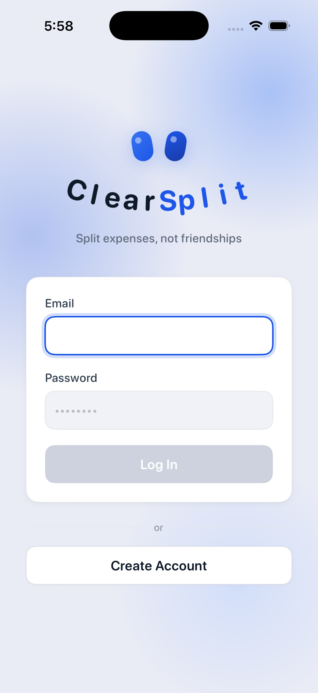
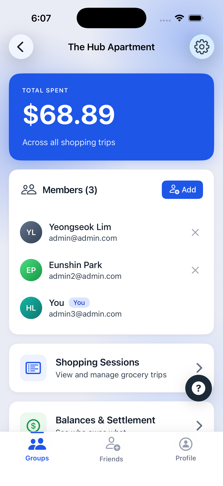
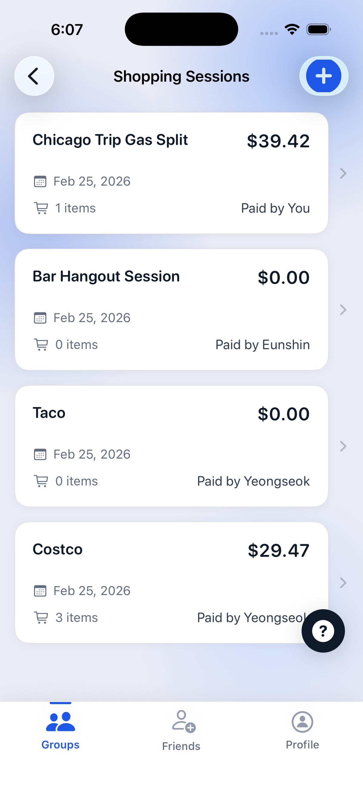
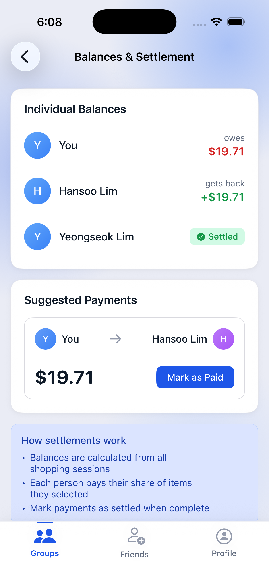
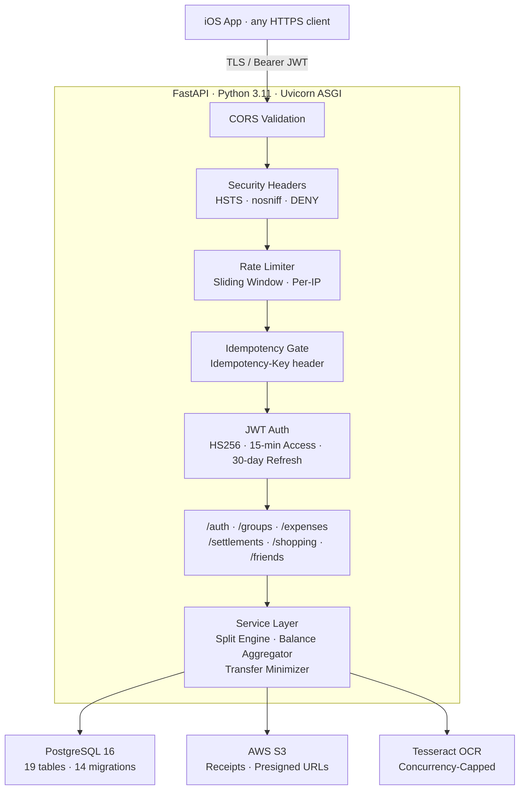
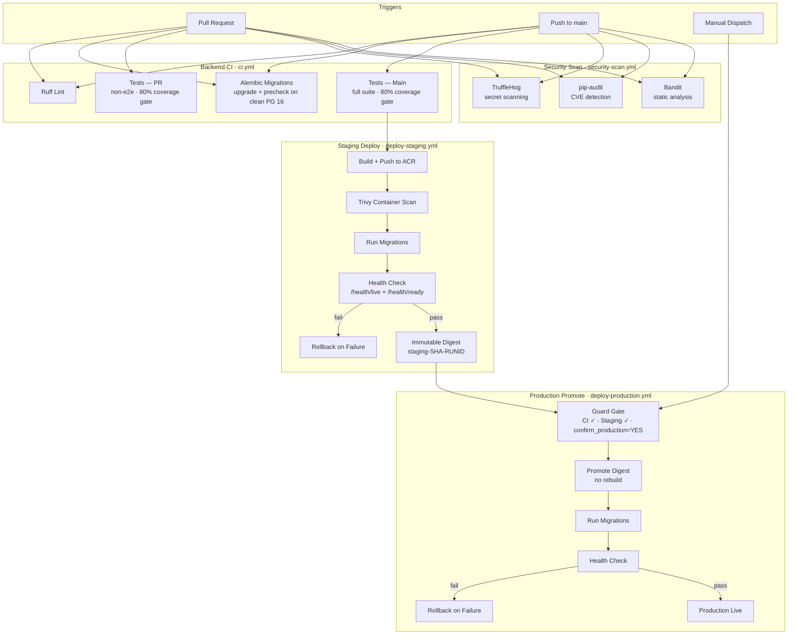
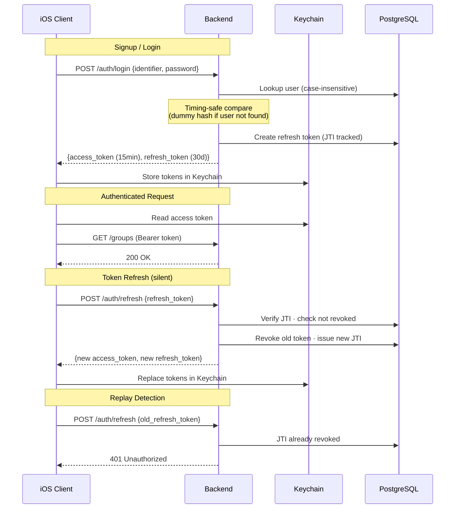

# ClearSplit

Full-stack expense splitting app — FastAPI backend, PostgreSQL, async SQLAlchemy, Azure Container Apps CI/CD, native iOS client.


I built ClearSplit because splitting expenses with my college friend group was consistently painful. Bank apps let you request money, but they don't show what you're actually paying for — no receipt details, no item breakdown, no transparency. Someone does the math on their phone, everyone just trusts it, and mistakes happen. ClearSplit lets everyone in the group upload receipts, see every item, and know exactly what they owe and why.

## App Preview

<p align="center">
  
  &nbsp;&nbsp;
  
  &nbsp;&nbsp;
  
  &nbsp;&nbsp;
  
</p>

<p align="center"><i>Login · Group Overview · Shopping Sessions · Settlement</i></p>

> Full 10-screen walkthrough with backend integration details: **[SHOWCASE.md](SHOWCASE.md)**

## Architecture Overview



## Tech Stack

| Layer | Technology | Why |
|-------|-----------|-----|
| Backend | FastAPI 0.122 + Uvicorn ASGI | Async-native, auto-generated OpenAPI docs |
| Database | PostgreSQL 16 + async SQLAlchemy 2.0 | ACID transactions, asyncpg for non-blocking I/O |
| Auth | JWT (HS256) + bcrypt | Stateless access tokens, rotating refresh with JTI tracking |
| Storage | AWS S3 + presigned URLs | Receipt images never proxy through the API on download |
| OCR | Tesseract (pytesseract + Pillow) | In-process — no external API dependency or per-call cost |
| Infra | Azure Container Apps + Docker | Health-gated rollouts, auto-scaling, no VM management |
| CI/CD | GitHub Actions (7 workflows) | OIDC federation — zero static credentials in the pipeline |
| iOS | SwiftUI + MVVM | Zero external dependencies, Keychain-backed auth storage |

## Design Decisions

| Decision | Why | Alternative Considered |
|----------|-----|----------------------|
| Integer cents over floats | Deterministic splits — zero rounding errors when dividing $14.99 between 3 people | `Decimal` type; still requires careful rounding policy |
| Async SQLAlchemy 2.0 with asyncpg | Non-blocking DB I/O under concurrent requests on a single Uvicorn process | Sync SQLAlchemy; simpler but blocks the event loop on every query |
| Refresh token rotation with JTI tracking | Detect token replay — if a revoked token is reused, the server rejects it immediately | Single long-lived token; no replay detection |
| `Idempotency-Key` header on mutations | Safe retries on network failure — same key returns cached response, different payload returns 409 | Client-side deduplication; can't protect against server-side double-writes |
| OIDC federation for CI/CD | Zero static credentials stored anywhere — GitHub proves identity to Azure per-run | Service principal with client secret; works but secret rotation is manual |
| Immutable settlement batches | Audit trail — once transfers are computed, the snapshot can't be retroactively edited | Mutable settlement records; simpler but no provenance |
| Promote (not rebuild) for production | The exact image that passed staging tests is what runs in production — no "works on my CI" gap | Rebuild from same commit; functionally equivalent but not binary-identical |
| In-process Tesseract with concurrency cap | No external OCR service dependency, controlled resource usage (default 2 concurrent) | Cloud OCR API (Google Vision, AWS Textract); better accuracy but adds cost and external dependency |

## CI/CD Pipeline

7 workflow files under `.github/workflows/`. The pipeline gates production behind both CI success _and_ staging success for the same commit — you can't skip staging.



Key points:

- **OIDC federation** — GitHub Actions authenticates to Azure per-run. No stored service principal secrets.
- **Build once, promote** — the staging image digest is promoted to production without rebuilding.
- **80% coverage gate** — enforced on both PR and main push. Blocks merge if tests drop below.
- **Trivy scan** — container vulnerability scanning before any deployment.
- **Health-gated rollout** — `/health/live` and `/health/ready` must pass; auto-rollback on failure.
- **Security scan** runs on every PR, every push, and weekly on cron (TruffleHog + pip-audit + Bandit).

## Database Schema

19 tables across 5 domains, managed by 14 Alembic migrations.

```mermaid
erDiagram
    users {
        uuid id PK
        string email UK
        string username UK
        string password_hash
    }
    refresh_tokens {
        uuid id PK
        uuid user_id FK
        string jti UK
        string replaced_by_jti
        timestamp revoked_at
    }
    idempotency_keys {
        uuid id PK
        uuid user_id FK
        string endpoint
        string key
        string request_hash
    }

    groups {
        uuid id PK
        string name
        string currency
        int version
    }
    memberships {
        uuid id PK
        uuid user_id FK
        uuid group_id FK
        enum role
    }
    friendships {
        uuid id PK
        uuid user_low_id FK
        uuid user_high_id FK
        uuid requester_id FK
        enum status
    }

    expenses {
        uuid id PK
        uuid group_id FK
        uuid paid_by FK
        bigint amount_cents
        string title
    }
    expense_splits {
        uuid id PK
        uuid expense_id FK
        uuid membership_id FK
        bigint amount_cents
    }

    shopping_sessions {
        uuid id PK
        uuid group_id FK
        uuid payer_membership_id FK
        string title
        enum status
    }
    shopping_session_participants {
        uuid id PK
        uuid session_id FK
        uuid membership_id FK
    }
    shopping_items {
        uuid id PK
        uuid session_id FK
        uuid created_by FK
        string name
        bigint total_cents
    }
    shopping_item_splits {
        uuid id PK
        uuid item_id FK
        uuid membership_id FK
        bigint amount_cents
    }
    receipt_uploads {
        uuid id PK
        uuid session_id FK
        uuid uploaded_by FK
        string s3_key
    }
    receipt_extracted_items {
        uuid id PK
        uuid receipt_id FK
        string raw_line
        float confidence
    }

    settlement_batches {
        uuid id PK
        uuid group_id FK
        enum status
        timestamp computed_at
    }
    settlements {
        uuid id PK
        uuid batch_id FK
        uuid from_membership FK
        uuid to_membership FK
        bigint amount_cents
    }
    settlement_payments {
        uuid id PK
        uuid group_id FK
        uuid sender_membership FK
        uuid receiver_membership FK
        bigint amount_cents
        enum status
    }
    settlement_payment_sessions {
        uuid payment_id FK
        uuid session_id FK
    }
    activity_logs {
        uuid id PK
        uuid group_id FK
        uuid user_id FK
        string action
    }

    users ||--o{ refresh_tokens : "has"
    users ||--o{ memberships : "joins"
    users ||--o{ idempotency_keys : "owns"
    users ||--o{ friendships : "participates"

    groups ||--o{ memberships : "has"
    groups ||--o{ expenses : "contains"
    groups ||--o{ shopping_sessions : "contains"
    groups ||--o{ settlement_batches : "has"
    groups ||--o{ settlement_payments : "has"
    groups ||--o{ activity_logs : "logs"

    memberships ||--o{ expense_splits : "owes"
    memberships ||--o{ shopping_session_participants : "joins"
    memberships ||--o{ shopping_item_splits : "shares"

    expenses ||--o{ expense_splits : "splits into"

    shopping_sessions ||--o{ shopping_session_participants : "includes"
    shopping_sessions ||--o{ shopping_items : "contains"
    shopping_sessions ||--o| receipt_uploads : "has"

    shopping_items ||--o{ shopping_item_splits : "divided among"

    receipt_uploads ||--o{ receipt_extracted_items : "produces"

    settlement_batches ||--o{ settlements : "contains"
    settlement_payments ||--o{ settlement_payment_sessions : "links"
```



## Request Lifecycle

Every request passes through the middleware chain before reaching a route handler. The chain is ordered — if rate limiting rejects you, the JWT check never runs.

```mermaid
flowchart LR
    Req["Incoming<br/>Request"] --> CORS["CORS<br/>Origin Validation"]
    CORS --> Sec["Security Headers<br/>HSTS · nosniff · DENY<br/>Referrer-Policy"]
    Sec --> RL["Rate Limiter<br/>Sliding Window<br/>Per-IP"]
    RL --> IK["Idempotency Check<br/>Cache hit → return<br/>Payload mismatch → 409"]
    IK --> JWT["JWT Auth<br/>Verify access token<br/>Inject current_user"]
    JWT --> Route["Route Handler<br/>Pydantic validation"]
    Route --> SVC["Service Layer<br/>Business logic<br/>Role checks"]
    SVC --> DB["PostgreSQL<br/>async SQLAlchemy"]
    DB --> Res["Response<br/>Sanitized errors<br/>No password leakage"]
```



**Trade-off note:** Rate limiting is process-local (in-memory sliding window per IP). This works fine for a single-replica deployment. Horizontal scaling would need a shared store like Redis.

## Auth Flow



Key details:

- **Timing-safe login** — the server always runs bcrypt verification, even for non-existent users (uses a dummy hash). This prevents timing side-channels that leak whether an account exists.
- **JTI rotation chain** — each refresh token has a unique ID. On refresh, the old JTI is revoked and the new one is recorded. Replaying a revoked token gets rejected.
- **Keychain storage** — tokens are stored with `kSecAttrAccessibleAfterFirstUnlockThisDeviceOnly`, not in UserDefaults or memory.

## API Highlights

47 endpoints across 6 domain routers. Full OpenAPI docs at `/docs` in local environment.

| Method | Endpoint | What's Interesting |
|--------|----------|--------------------|
| POST | `/auth/signup` | Rate-limited: 5 req / 5 min per IP |
| POST | `/auth/login` | Timing-safe; rate: 10 / 60s per IP |
| POST | `/auth/refresh` | JTI rotation — revokes old token, issues new |
| POST | `/groups/{id}/expenses` | Idempotent via `Idempotency-Key` header |
| GET | `/groups/{id}/balances` | Live balance aggregation + transfer minimization |
| POST | `/groups/{id}/settlements/compute` | Immutable batch snapshot (idempotent) |
| PUT | `/items/{id}/sharers` | Recalculates deterministic integer-cent splits |
| POST | `/shopping-sessions/{id}/receipt` | S3 upload with 10 MB / 25 MP validation |
| POST | `/receipts/{id}/extract-items` | OCR extraction with concurrency cap (default 2) |
| GET | `/receipts/{id}/download-url` | Presigned S3 URL (15-min TTL) |
| GET | `/health/ready` | Readiness probe — checks DB + S3 connectivity |
| POST | `/groups/{id}/members/preview` | Rate-limited preview before adding (30 / 60s) |

## Testing

147 tests across 13 files. CI enforces an 80% coverage gate on every PR and every push to main.

| Domain | Tests | What's Covered |
|--------|------:|----------------|
| Shopping | 32 | Session lifecycle, items, sharers, receipts, participant rules, access control |
| Groups & membership | 20 | CRUD, role enforcement, cascading deletes |
| Auth | 17 | Signup, login, timing-safe comparison, token validation |
| Security headers | 16 | HSTS, CORS, nosniff, X-Frame, token tampering, timing attacks |
| Settlements | 16 | Batch computation, payments, confirmation, transfer minimization |
| Friends | 14 | Requests, accept/decline, normalized edges, re-send after decline |
| Expenses | 13 | Creation, equal splits, remainder distribution, balances |
| DB connection config | 8 | TLS enforcement, connect_args per environment |
| Rate limiting | 5 | Sliding window behavior, proxy header handling |
| Refresh tokens | 4 | Rotation chain, replay detection, revocation |
| OCR | 1 | Tesseract extraction with mocked images |
| End-to-end | 1 | Full cross-domain user journey |

Testing practices:

- **Per-test transaction rollback** — each test runs in its own DB transaction that rolls back on completion, so tests don't interfere with each other
- **S3 stubs** — receipt operations use in-memory stubs, no real S3 calls in tests
- **Deterministic OCR mocks** — OCR tests use fixed image data for reproducible results
- **16 security-specific tests** — dedicated coverage for headers, CORS validation, timing attacks, and token tampering

## Project Structure

```
backend/
├── app/
│   ├── api/                  # Route handlers (thin — delegate to services)
│   │   ├── auth.py           #   signup, login, refresh, me
│   │   ├── groups.py         #   groups, memberships
│   │   ├── expenses.py       #   expense creation, splits
│   │   ├── settlements.py    #   batches, payments, confirmation
│   │   ├── shopping.py       #   sessions, items, receipts, OCR
│   │   └── friends.py        #   requests, accept/decline, list
│   ├── services/             # Business logic (thick — all domain rules live here)
│   ├── models/               # SQLAlchemy ORM (19 tables)
│   ├── schemas/              # Pydantic request/response DTOs
│   ├── auth/                 # JWT + bcrypt + FastAPI dependencies
│   ├── core/                 # Settings, rate limiter, idempotency
│   ├── db/                   # Async engine, session factory, TLS config
│   ├── settlement/           # Transfer minimization algorithm
│   ├── scripts/              # Migration precheck
│   ├── tests/                # 147 tests across 13 files
│   └── main.py               # App entry, middleware chain, health endpoints
├── alembic/
│   └── versions/             # 14 migrations (Dec 2024 – Feb 2026)
├── Makefile                  # 10 targets (test, lint, ci-pr, ci-main, etc.)
├── Dockerfile
├── requirements.txt
└── requirements-dev.txt
```

The pattern is **thin routes, thick services**. Route handlers parse input and return responses. Business logic — role checks, split calculations, balance aggregation — lives in the service layer, not in route files.

## Getting Started

### Docker (Quickest)

```bash
git clone <repo-url> && cd ClearSplit
cp .env.example .env
echo "JWT_SECRET=$(openssl rand -hex 32)" >> .env
docker compose up --build
# API  → http://localhost:8000
# Docs → http://localhost:8000/docs
```

`docker-compose.yml` runs PostgreSQL 16 + the API with live reload (volume-mounted `./backend`).

### Local Dev (No Docker)

```bash
cd backend
python3.11 -m venv venv && source venv/bin/activate
pip install -r requirements-dev.txt
# Requires PostgreSQL 16 running + DATABASE_URL in .env
alembic upgrade head
make run   # uvicorn --reload on :8000
```

### Makefile Targets

| Target | What It Does |
|--------|-------------|
| `make run` | Start dev server with auto-reload |
| `make test` | Run full test suite |
| `make test-pr` | PR gate — non-e2e, 80% coverage minimum |
| `make test-all` | Main gate — full suite, 80% coverage minimum |
| `make lint-ci` | Ruff linting |
| `make ci-pr` | Lint + PR tests (matches CI) |
| `make ci-main` | Lint + all tests (matches CI) |
| `make migrate` | `alembic upgrade head` |

## iOS Client

Native SwiftUI app with zero external dependencies. MVVM architecture, Keychain-backed auth with silent token refresh, and protocol-based services for testability. The networking layer — including multipart uploads, automatic 401 retry, and concurrent refresh deduplication — is built on Foundation alone.

See the full 10-screen walkthrough: **[SHOWCASE.md](SHOWCASE.md)**

## Documentation

| Document | Description |
|----------|-------------|
| [SHOWCASE.md](SHOWCASE.md) | iOS app walkthrough — 9 screens with backend integration details |
| [docs/architecture.md](docs/architecture.md) | System topology, layer architecture, domain flows |
| [docs/backend-reference.md](docs/backend-reference.md) | Full API surface, env vars, data model, auth rules |
| [docs/workflows-and-operations.md](docs/workflows-and-operations.md) | CI/CD pipelines, deployment flows, troubleshooting |
| [docs/ios-reference.md](docs/ios-reference.md) | iOS architecture, networking layer, state management |
| [docs/repository-map.md](docs/repository-map.md) | File-level codebase map |
| [SECURITY.md](SECURITY.md) | Security policy |
