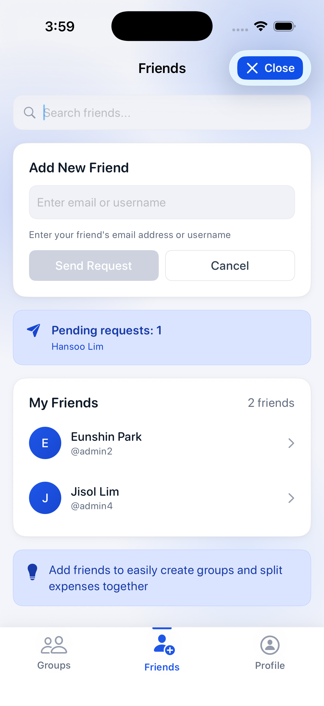
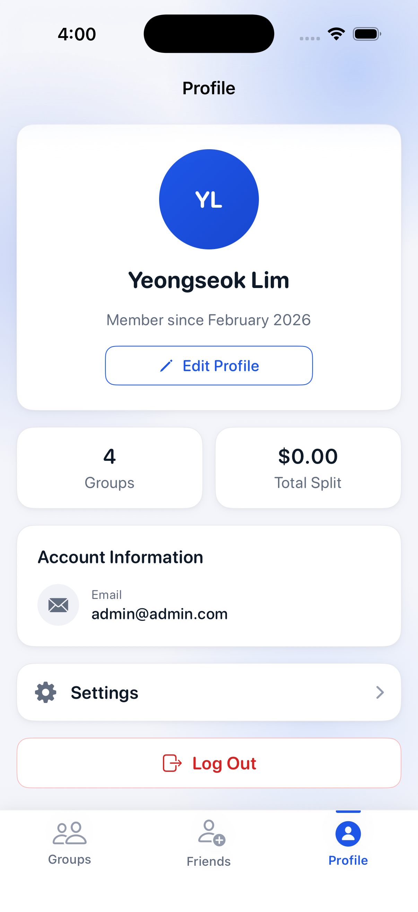
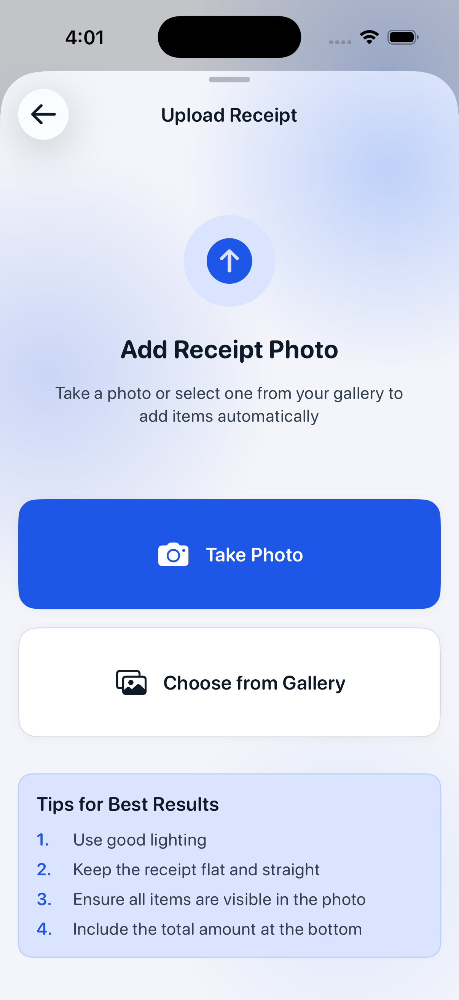
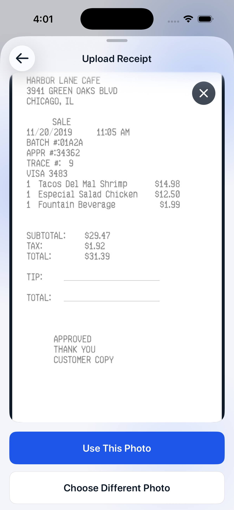
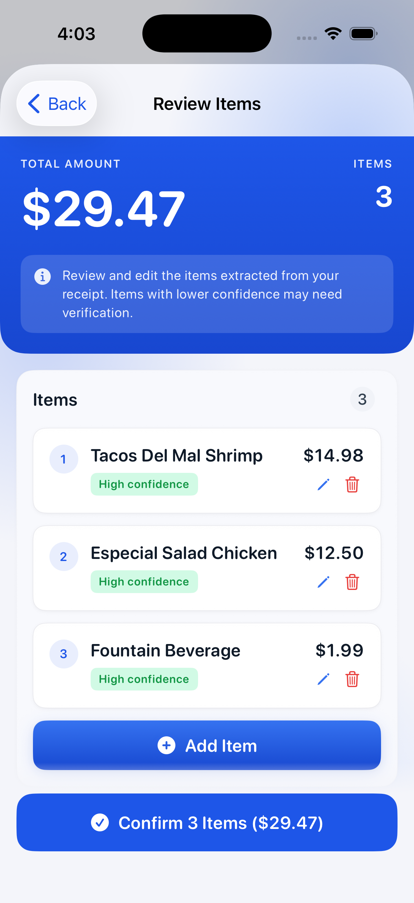
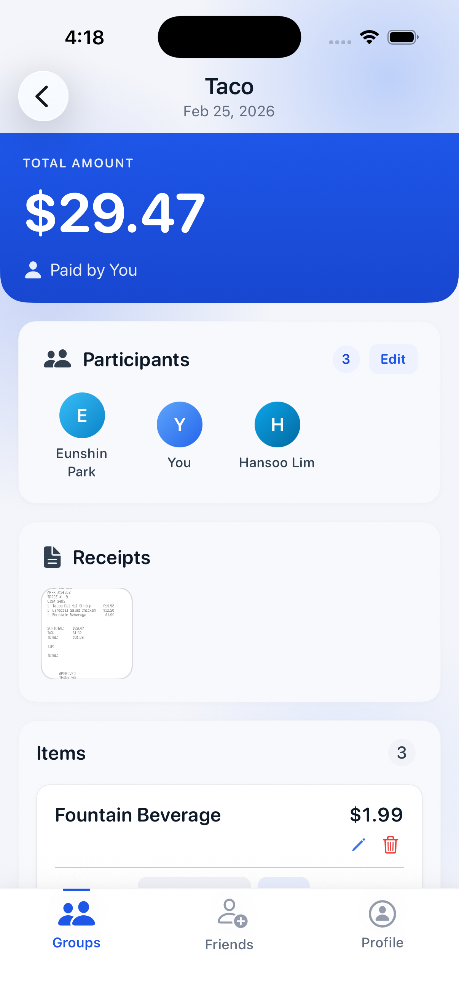

# ClearSplit iOS App — Design & Functionality Showcase

> **"Split expenses, not friendships."**

ClearSplit is a native iOS app built for people who share expenses — roommates splitting groceries, friends going out for dinner, or travel groups pooling costs. It takes the awkwardness out of "who owes what" by tracking every item, every receipt, and every payment in one place. No spreadsheets, no mental math, no guesswork.

This document walks through the actual iOS screens, explains what each one does, and shows how the frontend connects to the FastAPI backend behind the scenes.

---

## Tech at a Glance

| Layer | Stack |
|-------|-------|
| **iOS App** | SwiftUI (MVVM) · Zero external dependencies · Keychain-based auth |
| **Backend** | FastAPI · PostgreSQL 16 · SQLAlchemy (async) · JWT auth |
| **Infra** | Docker Compose (local) · Azure Container Apps (staging) · AWS S3 (receipts) |

---

## 1. Welcome & Login

<p align="center">
  
</p>

The first thing you see when you open ClearSplit. The brand logo and tagline — *"Split expenses, not friendships"* — set the tone. Below that, a clean login form with email and password fields.

**What happens when you tap "Log In":**

- The iOS `LoginViewModel` validates your input and fires a `POST /auth/login` request.
- The backend authenticates against a bcrypt-hashed password with timing-safe comparison (so even failed logins don't leak information about whether the account exists).
- On success, you get back a JWT access token (15-min TTL) and a refresh token (30-day TTL, rotated on each use). Both are stored securely in the iOS Keychain — not UserDefaults, not in memory.
- The app then calls `GET /auth/me` to pull your full profile and bootstraps the main view.

If you close and reopen the app later, it silently restores your session from the Keychain without asking you to log in again. The "Create Account" button at the bottom takes new users to the signup flow.

---

## 2. Friends

<p align="center">
  
</p>

The Friends tab is your social hub — everything in one place. From top to bottom:

- **Search bar** — filter your friends list by name or username.
- **Add New Friend** — type an email or username and send a friend request directly, no separate modal needed.
- **Pending Requests** — shows outgoing requests waiting for acceptance, with a count badge.
- **My Friends** — your accepted friends with avatars, display names, and usernames. Tap a friend to see shared groups and history.

The blue info banner at the bottom explains why friends matter: *"Add friends to easily create groups and split expenses together."*

**Backend integration:**

- `GET /friends` lists accepted friendships with optional search (`?q=...`).
- `POST /friends/requests` sends a new friend request.
- `GET /friends/requests/incoming` and `/outgoing` fetch pending requests.
- `POST /friends/requests/{id}/accept` or `/decline` handles responses.
- Friendships are stored as normalized pairs (lower UUID first) to prevent duplicates.

---

## 3. Profile

<p align="center">
  
</p>

The Profile tab shows your identity and activity summary:

- **Avatar** with your initials on a gradient background, generated client-side from your first and last name.
- **Full name** and **member since** date.
- **Edit Profile** button for updating your details.
- **Stats cards** — two side-by-side cards showing the number of groups you belong to and total amount split across all groups.
- **Account Information** — your registered email with an icon.
- **Settings** navigation row and **Log Out** button.

The stats are computed client-side from the groups and session data already loaded in the `AppState`. Every number reflects real data from the backend — nothing is mocked.

---

## 4. Upload Receipt

<p align="center">
  
</p>

Inside a shopping session, you can upload a receipt photo to automatically extract items. This screen presents two options:

- **Take Photo** — opens the camera to capture a receipt.
- **Choose from Gallery** — pick an existing photo from your library.

The "Tips for Best Results" section at the bottom guides users for optimal OCR accuracy: good lighting, flat receipt, all items visible, total amount included.

**Backend flow:**

- `POST /shopping-sessions/{id}/receipt` uploads the image to AWS S3 with presigned URLs.
- The backend validates file size (10 MB max) and image dimensions (25 MP max).
- The receipt image is stored in S3 — it never proxies through the API server on download.

---

## 5. Receipt Preview

<p align="center">
  
</p>

After selecting or capturing a photo, you see a full preview of the receipt image. The dismiss button (X) in the corner lets you remove the photo if it's not clear enough.

Two actions at the bottom:

- **Use This Photo** — confirms the selection and triggers the upload + OCR extraction pipeline.
- **Choose Different Photo** — goes back to pick another image.

This confirmation step prevents accidental uploads and lets users verify the receipt is legible before processing.

---

## 6. Review Items

<p align="center">
  
</p>

Once OCR extraction completes, you see all extracted items ready for review. The hero card at the top shows the **total amount** and **item count**.

The info banner explains: *"Review and edit the items extracted from your receipt. Items with lower confidence may need verification."*

Each item card shows:

- **Sequence number** — order from the receipt.
- **Item name** and **price** — extracted by Tesseract OCR.
- **Confidence badge** — "High confidence" in green means the OCR is confident in the extraction.
- **Edit** (pencil) and **delete** (trash) icons — fix any OCR mistakes before confirming.

At the bottom, **"+ Add Item"** lets you manually add anything the OCR missed, and **"Confirm Items"** finalizes the extraction and adds all items to the shopping session.

**Backend integration:**

- `POST /receipts/{id}/extract-items` runs Tesseract OCR with a concurrency cap (default 2 concurrent extractions).
- Each extracted item includes a confidence score and the raw line from the receipt.
- Confirmed items are created via `POST /shopping-sessions/{id}/items`.

---

## 7. Shopping Sessions

<p align="center">
  
</p>

Each shopping session represents one trip or one bill. The card shows:

- **Session title** and **total amount** — prominently displayed.
- **Date** of the shopping trip (calendar icon).
- **Number of items** added (cart icon).
- **Who paid** — shown at the bottom right of each card.

The blue "+" button in the top right creates a new session. The floating help button (?) at the bottom right provides contextual guidance.

**Backend flow:**

- `GET /groups/{id}/shopping-sessions` lists all sessions with items, participants, and receipt metadata eagerly loaded.
- `POST /groups/{id}/shopping-sessions` creates a new session. The payer is always the creator.
- Sessions have three statuses: **Active** (editable), **Finalized** (locked for settlement), and **Settled** (all payments complete).
- Swipe left to delete — cascades through items, splits, and receipts.

---

## 8. Session Detail

<p align="center">
  
</p>

Inside a session, you get the full breakdown. The blue hero card shows the **total amount** and **who paid**.

Below that:

- **Participants** — the people sharing this bill, shown as avatars with names in a horizontal grid. The count badge and "Edit" link let owners manage who's included. "You" is highlighted with a distinct avatar color.
- **Receipts** — uploaded receipt thumbnails. Tap to view the full image, fetched via a presigned S3 URL with 15-minute TTL.
- **Items** — the actual purchases with prices. Each item shows its name, total price, and action icons (edit/delete).

**Backend integration:**

- `GET /shopping-sessions/{id}` returns the full session with items, participants, and receipts.
- `PUT /shopping-sessions/{id}/participants` updates who's sharing (payer-only action).
- `GET /receipts/{id}/download-url` returns a short-lived S3 presigned URL for receipt images.

---

## 9. Balances & Settlement

<p align="center">
  
</p>

This is where everything comes together. The settlement screen answers the only question that matters: **who owes who, and how much?**

**Individual Balances** shows each member's net position:
- "You" owes **$24.99** (shown in red)
- Yeongseok Lim gets back **+$41.04** (shown in green)
- Hansoo Lim owes **$16.05** (shown in red)

**Suggested Payments** shows the simplest way to settle up — a transfer visualization with avatars:
- You → Yeongseok Lim: **$24.99**

The **"Mark as Paid"** button records the payment. Once confirmed, the transfer row shows a confirmation badge with a timestamp.

The light blue explainer card at the bottom — *"How settlements work"* — walks users through the process: balances computed from all sessions, each person pays their share, and payments are marked as settled.

**How balances are calculated on the backend (`GET /groups/{id}/balances`):**

The settlement service aggregates across all data sources:
1. **Expense payments** — what each person paid
2. **Expense splits** — what each person owes
3. **Shopping session items** — item-level shares from all active sessions

It computes a net balance per member (paid minus owed), then runs a **transfer minimization algorithm** to suggest the fewest payments needed to settle everyone up.

---

## Design Philosophy

A few things that shaped how these screens look and feel:

**Minimal, card-based layout** — Every piece of information lives in a card with consistent spacing and rounded corners. Cards create visual hierarchy without needing heavy borders or backgrounds, and they translate well to different screen sizes.

**Brand blue as the primary accent** — The brand blue (#1E56E8) is used sparingly: CTAs, active tabs, hero cards, and the logo. Everything else is neutral surfaces and grays. This keeps the interface calm — fitting for an app that deals with money.

**Progressive disclosure** — The app doesn't dump everything on you. It shows summaries first and lets you drill into sessions, items, receipts, and settlements one level at a time.

**Real data, always** — Every number on screen comes from the backend. There are no hardcoded placeholders. The totals, balances, and item prices are all computed from actual database records through the API.

**Zero external dependencies on iOS** — The entire app is built with Foundation and SwiftUI. No Alamofire, no Kingfisher, no third-party UI kit. This keeps the binary small, builds fast, and avoids supply chain risk.

---

## Full User Flow

Here's how a typical session plays out, end to end:

```
Sign Up / Log In
       |
   My Groups ──────────── Create New Group
       |
  Group Overview
       |
   ┌───┼──────────────┐
   |   |               |
Members  Shopping    Balances &
   |    Sessions     Settlement
   |       |              |
  Add    Create         View who
 Member  Session       owes what
           |              |
      Add Items      Mark as Paid
      Set Sharers
      Upload Receipt
      (OCR → Review Items)
```

Every arrow in this flow is a real API call. Every screen is a real SwiftUI view. Every number is computed from PostgreSQL through FastAPI.

---

## API Endpoints by Screen

For reference, here's a mapping of every screen to the backend endpoints it talks to:

| Screen | Endpoints |
|--------|-----------|
| Login | `POST /auth/login`, `GET /auth/me` |
| Friends | `GET /friends`, `GET /friends/requests/incoming`, `GET /friends/requests/outgoing`, `POST /friends/requests`, `POST /friends/requests/{id}/accept` |
| Profile | `GET /auth/me` (cached in AppState) |
| Upload Receipt | `POST /shopping-sessions/{id}/receipt` |
| Review Items | `POST /receipts/{id}/extract-items`, `POST /shopping-sessions/{id}/items` |
| Shopping Sessions | `GET /groups/{id}/shopping-sessions`, `POST /groups/{id}/shopping-sessions` |
| Session Detail | `GET /shopping-sessions/{id}`, `PUT /shopping-sessions/{id}/participants`, `GET /receipts/{id}/download-url` |
| Balances & Settlement | `GET /groups/{id}/balances`, `POST /groups/{id}/settlement-payments`, `POST /settlement-payments/{id}/confirm` |

---

*Built with SwiftUI and FastAPI. Designed for clarity. Engineered for correctness.*
