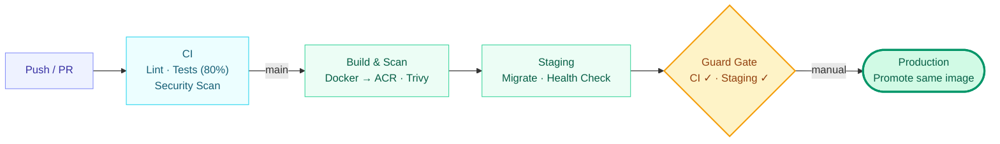
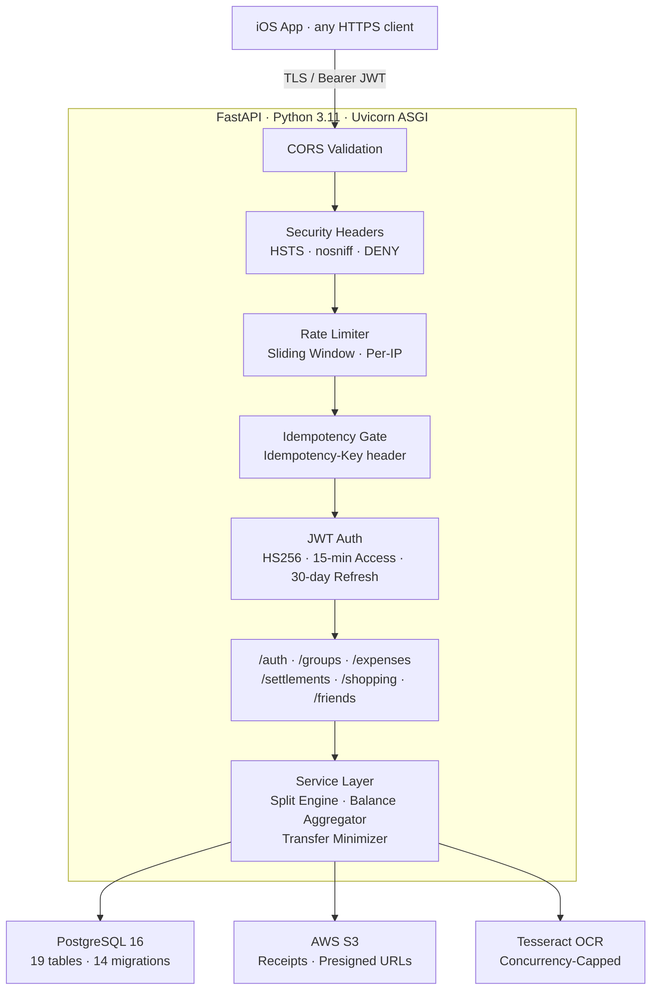
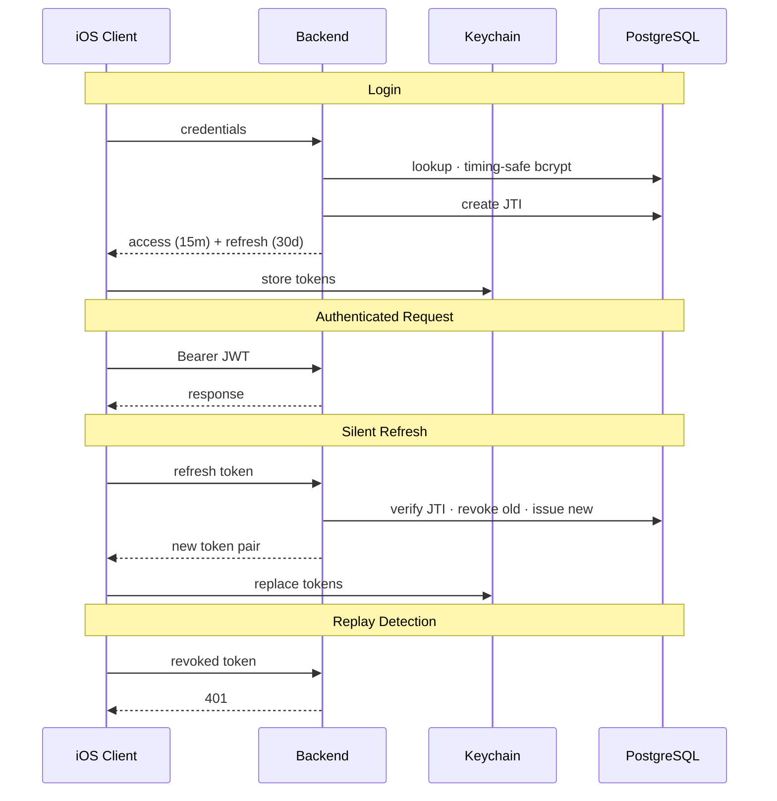

# ClearSplit

ClearSplit is a Full stack expense splitting app — FastAPI backend, PostgreSQL, async SQLAlchemy, Azure Container Apps CI/CD, native iOS client.


\


I built ClearSplit after getting frustrated with how messy it was to split expenses with my college friends. 😥\
Zelle let you request money, but they don’t show what you’re actually paying for. There’s no receipt detail, no item breakdown, no real transparency.\
Usually one person does the math on their phone, everyone just trusts it, and mistakes slip through and embrass moment happens.\
ClearSplit fixes that by letting everyone upload receipts, see every item clearly, and understand exactly what they owe — and why.

## App Preview

<p align="center">
  
  &nbsp;&nbsp;
  
  &nbsp;&nbsp;
  
  &nbsp;&nbsp;
  
</p>

<p align="center"><i>Login · Group Overview · Shopping Sessions · Settlement</i></p>

> Full 10-screen walkthrough with backend integration details: **[SHOWCASE.md](SHOWCASE.md)**

## CI/CD Pipeline

7 GitHub Actions workflows. Push to main triggers the full pipeline — production requires both CI and staging to pass on the same commit.



- **Zero stored secrets** — OIDC federation authenticates GitHub Actions to Azure per-run.
- **Build once, promote** — the exact image digest verified in staging is promoted to production unchanged.
- **80% coverage gate** — PRs and pushes to main are blocked below threshold.
- **Pre-deploy scanning** — Trivy + TruffleHog + pip-audit + Bandit on every pipeline run.
- **Self-healing deploys** — health probes gate rollout; failures trigger automatic rollback.

## Architecture Overview



## Tech Stack

| Layer          | Technology                                   | Why it’s used                                                                 |
|---------------|----------------------------------------------|--------------------------------------------------------------------------------|
| API           | FastAPI (async) + Uvicorn                    | High-performance async API with automatic OpenAPI documentation                |
| Data          | PostgreSQL 16                                | Strong consistency + transactional guarantees |
| ORM           | SQLAlchemy 2 (async) + asyncpg               | Asynchronous database access with a well-established ORM                  |
| Auth          | JWT access + rotating refresh (JTI) + bcrypt | Stateless access tokens + revocable refresh tokens + secure password hashing |
| Object Storage| S3 + presigned URLs                          | Direct client uploads and downloads via presigned URLs              |
| OCR           | Tesseract (pytesseract + Pillow)             | Runs locally/in-container; no external OCR dependency                        |
| Infra         | Docker + Azure Container Apps                | Managed container platform with autoscaling and health-based deployments             |
| CI/CD         | GitHub Actions + OIDC                        | Builds and deploys without storing cloud secrets in the repository                        |
| iOS           | SwiftUI + MVVM + Keychain                    | Native UI with maintainable state + secure token storage                     |

## Key Design Decisions

| Decision | Why | Alternative |
|----------|-----|------------|
| Integer cents (no floats) | Avoids rounding errors in money calculations | Decimal type |
| Async SQLAlchemy + asyncpg | Non-blocking DB access under concurrency | Sync ORM |
| Refresh token rotation (JTI) | Detects and blocks token replay | Long-lived token |
| `Idempotency-Key` on writes | Safe retries without duplicate writes | Client-side dedup |
| OIDC for CI/CD | No stored cloud secrets | Service principal + secret |
| Immutable settlement batches | Preserves audit history | Mutable records |
| Promote, don’t rebuild | Same tested image goes to production | Rebuild from commit |
| In-process Tesseract | No external OCR dependency | Cloud OCR API |

## Database Schema

19 tables across 6 domains, managed by 14 Alembic migrations.
| Domain | Tables |
|---|---|
| Auth | `users`, `refresh_tokens`, `idempotency_keys` |
| Social | `groups`, `memberships`, `friendships` |
| Expenses | `expenses`, `expense_splits` |
| Shopping | `shopping_sessions`, `shopping_items`, `shopping_item_splits`, `shopping_session_participants` |
| Receipts | `receipt_uploads`, `receipt_extracted_items` |
| Settlements | `settlement_batches`, `settlements`, `settlement_payments`, `settlement_payment_sessions`, `activity_logs` |

```mermaid
erDiagram
    users {
        uuid id PK
        string email UK
        string username UK
        string password_hash
    }
    refresh_tokens {
        uuid id PK
        uuid user_id FK
        string jti UK
        string replaced_by_jti
        timestamp revoked_at
    }
    idempotency_keys {
        uuid id PK
        uuid user_id FK
        string endpoint
        string key
        string request_hash
    }

    groups {
        uuid id PK
        string name
        string currency
        int version
    }
    memberships {
        uuid id PK
        uuid user_id FK
        uuid group_id FK
        enum role
    }
    friendships {
        uuid id PK
        uuid user_low_id FK
        uuid user_high_id FK
        uuid requester_id FK
        enum status
    }

    expenses {
        uuid id PK
        uuid group_id FK
        uuid paid_by FK
        bigint amount_cents
        string title
    }
    expense_splits {
        uuid id PK
        uuid expense_id FK
        uuid membership_id FK
        bigint amount_cents
    }

    shopping_sessions {
        uuid id PK
        uuid group_id FK
        uuid payer_membership_id FK
        string title
        enum status
    }
    shopping_session_participants {
        uuid id PK
        uuid session_id FK
        uuid membership_id FK
    }
    shopping_items {
        uuid id PK
        uuid session_id FK
        uuid created_by FK
        string name
        bigint total_cents
    }
    shopping_item_splits {
        uuid id PK
        uuid item_id FK
        uuid membership_id FK
        bigint amount_cents
    }
    receipt_uploads {
        uuid id PK
        uuid session_id FK
        uuid uploaded_by FK
        string s3_key
    }
    receipt_extracted_items {
        uuid id PK
        uuid receipt_id FK
        string raw_line
        float confidence
    }

    settlement_batches {
        uuid id PK
        uuid group_id FK
        enum status
        timestamp computed_at
    }
    settlements {
        uuid id PK
        uuid batch_id FK
        uuid from_membership FK
        uuid to_membership FK
        bigint amount_cents
    }
    settlement_payments {
        uuid id PK
        uuid group_id FK
        uuid sender_membership FK
        uuid receiver_membership FK
        bigint amount_cents
        enum status
    }
    settlement_payment_sessions {
        uuid payment_id FK
        uuid session_id FK
    }
    activity_logs {
        uuid id PK
        uuid group_id FK
        uuid user_id FK
        string action
    }

    users ||--o{ refresh_tokens : "has"
    users ||--o{ memberships : "joins"
    users ||--o{ idempotency_keys : "owns"
    users ||--o{ friendships : "participates"

    groups ||--o{ memberships : "has"
    groups ||--o{ expenses : "contains"
    groups ||--o{ shopping_sessions : "contains"
    groups ||--o{ settlement_batches : "has"
    groups ||--o{ settlement_payments : "has"
    groups ||--o{ activity_logs : "logs"

    memberships ||--o{ expense_splits : "owes"
    memberships ||--o{ shopping_session_participants : "joins"
    memberships ||--o{ shopping_item_splits : "shares"

    expenses ||--o{ expense_splits : "splits into"

    shopping_sessions ||--o{ shopping_session_participants : "includes"
    shopping_sessions ||--o{ shopping_items : "contains"
    shopping_sessions ||--o| receipt_uploads : "has"

    shopping_items ||--o{ shopping_item_splits : "divided among"

    receipt_uploads ||--o{ receipt_extracted_items : "produces"

    settlement_batches ||--o{ settlements : "contains"
    settlement_payments ||--o{ settlement_payment_sessions : "links"
```



## Request Lifecycle

Every request passes through the middleware chain before reaching a route handler. The chain is ordered — if rate limiting rejects you, the JWT check never runs.


> **Trade-off:** Rate limiting is process-local (in-memory sliding window per IP) — sufficient for single-replica deployments. Horizontal scaling would require a shared store such as Redis.

---

## Auth Flow


- **Timing-safe login** — bcrypt verification always runs, even for non-existent users (dummy hash fallback). Prevents timing side-channels that reveal whether an account exists.
- **JTI rotation** — each refresh token carries a unique ID. On refresh, the old JTI is revoked and a new one is issued. Replaying a revoked token is rejected immediately.
- **Secure Keychain storage** — tokens persist under `kSecAttrAccessibleAfterFirstUnlockThisDeviceOnly`, never in UserDefaults or memory.
## API Highlights

47 endpoints across 6 domain routers. Full OpenAPI docs available at `/docs`.

| Method | Endpoint | Notes |
|--------|----------|-------|
| POST | `/auth/signup` | Rate-limited to 5 requests / 5 min per IP |
| POST | `/auth/login` | Always runs bcrypt to prevent user enumeration; 10 req / 60s |
| POST | `/auth/refresh` | Issues new token and invalidates the old one on every call |
| POST | `/groups/{id}/expenses` | Safe to retry — duplicate requests return the original response |
| GET | `/groups/{id}/balances` | Computes live balances and minimizes the number of transfers to settle |
| POST | `/groups/{id}/settlements/compute` | Creates an immutable snapshot; re-calling returns the same result |
| PUT | `/items/{id}/sharers` | Splits cost in integer cents with no rounding drift |
| POST | `/shopping-sessions/{id}/receipt` | Validates file size (10 MB) and resolution (25 MP) before uploading to S3 |
| POST | `/receipts/{id}/extract-items` | Runs OCR with a concurrency cap to prevent runaway API costs |
| GET | `/receipts/{id}/download-url` | Returns a short-lived presigned URL (expires in 15 min) |
| GET | `/health/ready` | Confirms DB and S3 are reachable before accepting traffic |
| POST | `/groups/{id}/members/preview` | Dry-run endpoint — shows result before committing the action |

## Testing

147 tests across 13 files. CI enforces an 80% coverage gate on every PR and every push to main.

| Domain | Tests | What's Covered |
|--------|------:|----------------|
| Shopping | 32 | Session lifecycle, items, sharers, receipts, participant rules, access control |
| Groups & membership | 20 | CRUD, role enforcement, cascading deletes |
| Auth | 17 | Signup, login, timing-safe comparison, token validation |
| Security headers | 16 | HSTS, CORS, nosniff, X-Frame, token tampering, timing attacks |
| Settlements | 16 | Batch computation, payments, confirmation, transfer minimization |
| Friends | 14 | Requests, accept/decline, normalized edges, re-send after decline |
| Expenses | 13 | Creation, equal splits, remainder distribution, balances |
| DB connection config | 8 | TLS enforcement, connect_args per environment |
| Rate limiting | 5 | Sliding window behavior, proxy header handling |
| Refresh tokens | 4 | Rotation chain, replay detection, revocation |
| OCR | 1 | Tesseract extraction with mocked images |
| End-to-end | 1 | Full cross-domain user journey |

Testing practices:

- **Per-test transaction rollback** — each test runs in its own DB transaction that rolls back on completion, so tests don't interfere with each other
- **S3 stubs** — receipt operations use in-memory stubs, no real S3 calls in tests
- **Deterministic OCR mocks** — OCR tests use fixed image data for reproducible results
- **16 security-specific tests** — dedicated coverage for headers, CORS validation, timing attacks, and token tampering

## Project Structure

```
backend/
├── app/
│   ├── api/                  # Route handlers (thin — delegate to services)
│   │   ├── auth.py           #   signup, login, refresh, me
│   │   ├── groups.py         #   groups, memberships
│   │   ├── expenses.py       #   expense creation, splits
│   │   ├── settlements.py    #   batches, payments, confirmation
│   │   ├── shopping.py       #   sessions, items, receipts, OCR
│   │   └── friends.py        #   requests, accept/decline, list
│   ├── services/             # Business logic (thick — all domain rules live here)
│   ├── models/               # SQLAlchemy ORM (19 tables)
│   ├── schemas/              # Pydantic request/response DTOs
│   ├── auth/                 # JWT + bcrypt + FastAPI dependencies
│   ├── core/                 # Settings, rate limiter, idempotency
│   ├── db/                   # Async engine, session factory, TLS config
│   ├── settlement/           # Transfer minimization algorithm
│   ├── scripts/              # Migration precheck
│   ├── tests/                # 147 tests across 13 files
│   └── main.py               # App entry, middleware chain, health endpoints
├── alembic/
│   └── versions/             # 14 migrations (Dec 2024 – Feb 2026)
├── Makefile                  # 10 targets (test, lint, ci-pr, ci-main, etc.)
├── Dockerfile
├── requirements.txt
└── requirements-dev.txt
```

The pattern is **thin routes, thick services**. Route handlers parse input and return responses. Business logic — role checks, split calculations, balance aggregation — lives in the service layer, not in route files.

## Getting Started

### Docker (Quickest)

```bash
git clone <repo-url> && cd ClearSplit
cp .env.example .env
echo "JWT_SECRET=$(openssl rand -hex 32)" >> .env
docker compose up --build
# API  → http://localhost:8000
# Docs → http://localhost:8000/docs
```

`docker-compose.yml` runs PostgreSQL 16 + the API with live reload (volume-mounted `./backend`).

### Local Dev (No Docker)

```bash
cd backend
python3.11 -m venv venv && source venv/bin/activate
pip install -r requirements-dev.txt
# Requires PostgreSQL 16 running + DATABASE_URL in .env
alembic upgrade head
make run   # uvicorn --reload on :8000
```

### Makefile Targets

| Target | What It Does |
|--------|-------------|
| `make run` | Start dev server with auto-reload |
| `make test` | Run full test suite |
| `make test-pr` | PR gate — non-e2e, 80% coverage minimum |
| `make test-all` | Main gate — full suite, 80% coverage minimum |
| `make lint-ci` | Ruff linting |
| `make ci-pr` | Lint + PR tests (matches CI) |
| `make ci-main` | Lint + all tests (matches CI) |
| `make migrate` | `alembic upgrade head` |

## iOS Client

Native SwiftUI app with zero external dependencies. MVVM architecture, Keychain-backed auth with silent token refresh, and protocol-based services for testability. The networking layer — including multipart uploads, automatic 401 retry, and concurrent refresh deduplication — is built on Foundation alone.

See the full 12-screen walkthrough: **[SHOWCASE.md](SHOWCASE.md)**

## Documentation

| Document | Description |
|----------|-------------|
| [SHOWCASE.md](SHOWCASE.md) | iOS app walkthrough — 12 screens with backend integration details |
| [docs/architecture.md](docs/architecture.md) | System topology, layer architecture, domain flows |
| [docs/backend-reference.md](docs/backend-reference.md) | Full API surface, env vars, data model, auth rules |
| [docs/workflows-and-operations.md](docs/workflows-and-operations.md) | CI/CD pipelines, deployment flows, troubleshooting |
| [docs/ios-reference.md](docs/ios-reference.md) | iOS architecture, networking layer, state management |
| [docs/repository-map.md](docs/repository-map.md) | File-level codebase map |
| [SECURITY.md](SECURITY.md) | Security policy |